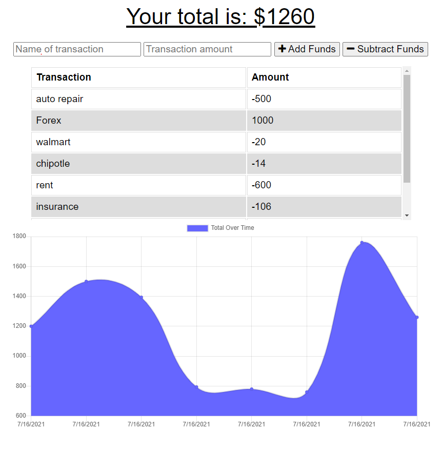

# Budget Tracker

## Description 

   A budget tracking web application that allow for offline access and functionality. Users can add expenses and deposits to their budget with or without an internet connection. Some of the main tools/packages utilized in this project are Node.js, express, mongoDB,and  mongoose.

  Deployed link - 

  

## Installation

  - Clone/Download the project
  - From the budget-tracker directory in your terminal/command line run 'npm install'
  
## Usage 
  - From the home page you can add a transaction:
    - Entering the name of the transaction.
    - Entering the transaction amount.
    - clicking on the add funds or subtract funds button
  - All transactions will be listed in a table with a graph representation below

## Questions
  - 👋 Hi, I’m dkbaffour777
  - GitHub profile link: [github.com/dkbaffour777/](https://github.com/dkbaffour777/)
  - 📫 How to reach, email: dkbaffour777career@gmail.com
